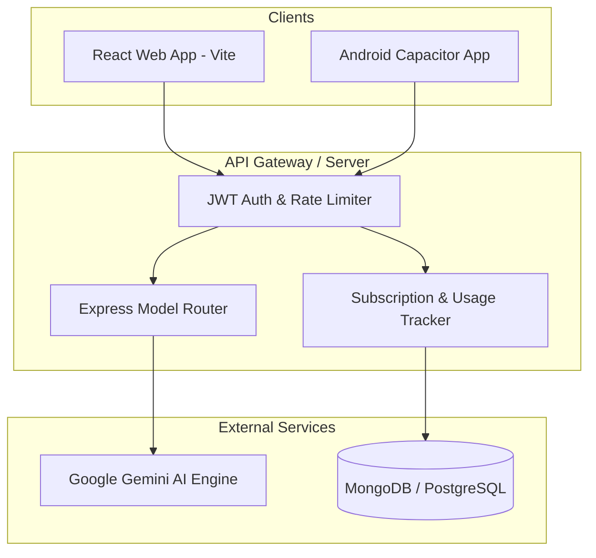

# Kiri AI - Full-Stack AI Chat & Generation Platform

[](LICENSE)
[](https://nodejs.org)
[](https://react.dev)
[](https://ai.google.dev)
[](https://capacitorjs.com)
[](SECURITY.md)

**Kiri AI** is a production-grade full-stack conversational AI and creative generation platform powered by Google Gemini. It features real-time chat with streaming responses, dynamic personality switching, daily quota management, tiered subscription plans, an interactive Image Lab, and an Android mobile client.

---

## 📌 Features

- 💬 **Intelligent Chat**: Real-time multi-model AI conversations powered by Google Gemini with markdown and syntax-highlighted code rendering.
- 🎨 **Image Lab**: Interactive visual generation and customization studio.
- 🔐 **JWT Authentication**: Secure user registration, credential hashing, and session management.
- 💳 **Tiered Subscriptions**: Built-in quota tracking (Free tier, Premium, and Yearly plans).
- 📱 **Cross-Platform**: Responsive modern web interface (React + Vite) and dedicated Android app (Capacitor).
- 🎬 **Branding & Splash**: High-fidelity 4K intro animations for marketing and mobile launch screens.

---

## 🛠️ Tech Stack

### Frontend
- **Framework**: React 18, Vite
- **Styling**: Modern CSS3 (Dark/Light mode variables, Glassmorphism, Micro-animations)
- **Deployment**: Netlify, Vercel, GitHub Pages

### Backend
- **Runtime**: Node.js
- **Server Framework**: Express.js
- **AI Integration**: Google Generative AI SDK (Gemini)
- **Security**: JWT (`jsonwebtoken`), `bcryptjs`, `express-rate-limit`, `cors`
- **Database Support**: In-memory caching, MongoDB (Mongoose), PostgreSQL, Supabase

### Mobile & DevOps
- **Mobile**: Capacitor Android (`android-app/`)
- **Containerization**: Docker (`Dockerfile`, `.dockerignore`)
- **Cloud Deployment**: Render (`render.yaml`), Railway, Fly.io

---

## 🏛️ System Architecture



---

## 🚀 Getting Started

### Prerequisites
- [Node.js](https://nodejs.org/) (v18.x or v20.x recommended)
- [npm](https://www.npmjs.com/) or [yarn](https://yarnpkg.com/)
- [Google AI Studio API Key](https://aistudio.google.com/app/apikey)

---

### Installation & Local Setup

1. **Clone the Repository**:
   ```bash
   git clone https://github.com/kriss2012/kiri-ai.git
   cd kiri-ai
   ```

2. **Backend Setup**:
   ```bash
   cd backend
   npm install
   ```

   Create a `.env` file in `backend/` using the template below:
   ```env
   PORT=3001
   GEMINI_API_KEY=your_google_gemini_api_key_here
   JWT_SECRET=your_secure_random_jwt_secret_key
   ```

   Start the backend server:
   ```bash
   npm run dev
   # Server runs at http://localhost:3001
   ```

3. **Frontend Setup**:
   ```bash
   cd ../frontend
   npm install
   npm run dev
   # Development server runs at http://localhost:5173
   ```

---

## 📡 API Endpoints

| Method | Route | Auth Required | Description |
| :--- | :--- | :---: | :--- |
| `POST` | `/api/auth/register` | No | Create new user account |
| `POST` | `/api/auth/login` | No | Authenticate user & return JWT |
| `GET` | `/api/auth/me` | Yes | Retrieve authenticated user profile |
| `POST` | `/api/chat` | Yes | Send prompt to Gemini AI engine |
| `GET` | `/api/plans` | No | Fetch subscription tiers & pricing |
| `POST` | `/api/subscribe` | Yes | Upgrade user subscription tier |
| `GET` | `/api/usage` | Yes | Inspect daily prompt quota & usage |
| `GET` | `/api/health` | No | Health check endpoint |

---

## 🔒 Security Policy

Please refer to [SECURITY.md](SECURITY.md) for vulnerability disclosure guidelines and security standards.

## 🤝 Contributing

Contributions are welcome! Please see [CONTRIBUTING.md](CONTRIBUTING.md) and [CODE_OF_CONDUCT.md](CODE_OF_CONDUCT.md) for our code standards and pull request process.

## 📄 License

This project is licensed under the MIT License - see the [LICENSE](LICENSE) file for details.

## 👤 Author

Developed and maintained by **[Krishna Patil](https://github.com/kriss2012)**.
