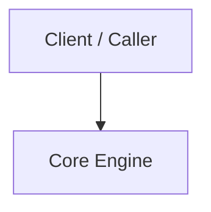

# kiri-ai

A modern Unknown project engineered by Krishna Patil.

[](LICENSE) [](https://github.com/kriss2012/kiri-ai)

---

## 📌 Overview

**kiri-ai** is engineered for clarity, modularity, and high-performance execution.

## 🛠️ Tech Stack


## 🏛️ Architecture



## 🚀 Getting Started

### Prerequisites
- Git
- Unknown Runtime Environment

### Installation

```bash
# Clone repository
git clone https://github.com/{self.username}/{name}.git
cd {name}
# Open project in your preferred IDE or browser
```

### Running the Application

```bash
# Launch according to project structure
```

## 🔒 Security

For security policies and reporting vulnerabilities, please see [SECURITY.md](SECURITY.md).

## 🤝 Contributing

Contributions, issues, and feature requests are welcome! See [CONTRIBUTING.md](CONTRIBUTING.md) for contribution guidelines and code of conduct.

## 📄 License

This project is licensed under the MIT License - see the [LICENSE](LICENSE) file for details.

## 👤 Author

Developed by **[Krishna Patil](https://github.com/kriss2012)**.

---

## Author

Developed and maintained by **[Krishna Patil](https://github.com/kriss2012)**.
